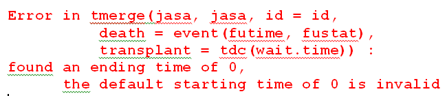

```{r setup, include=FALSE}
library(knitr)
library(survival)
library(survminer)
library(tidyverse)
library(hexbin)

options(stringsAsFactors=F,
        contrasts=c("contr.treatment","contr.poly"),
        show.signif.stars = FALSE,
        continue=" ", width=60)

opts_chunk$set(echo=FALSE, message=FALSE, warning=FALSE, collapse=TRUE,
               prompt=TRUE, cache=FALSE, comment=NA, tidy=FALSE,
               out.width="\\textwidth", out.height="!")

plotTheme <-  theme_bw() +  
              theme(plot.title = element_text(size = 20),  
                    strip.text = element_text(size=18),  
                    axis.text = element_text(size=15),  
                    axis.title = element_text(size=18),  
                    legend.text=element_text(size=15),  
                    legend.title=element_text(size=18))  
```

## Outline

* Time to event - one observation per subject

* Start/Stop data
  + Why needed?
  + New tools: `tmerge`, `survSplit` 
  + Check data: `survcheck`
  + Common mistakes

* Multistate data
  + Competing risk 

# Basics

## Logistics

* All code shown based on https://github.com/therneau/survival (version 3.0)
* Slides/Example code available at https://github.com/bethatkinson/rmed2019_survival

```{r  out.width = "20%"}
 
```

## Background

* I am a statistician working in medical research
* Many of the questions I work with are "time until ..."
  + Fracture
  + Diagnosis of a chronic comorbidity
  + Liver transplant
  + Death
  + ...
* I study osteoporosis in a population-based cohort, so many of my examples deal with fractures 

## Premise

Most statistics discussions focus on the analysis and assume the data is already in shape. The reality is that:

* Data wrangling takes much of the time
* Doing it correctly is critical
* ... so that's what I'll talk about

## Some principles of data creation

* Correct is more important than fast: Don't worry if the code takes a bit to run.  We often do dozens of fits to a dataset
* Correct is more important than clever
* Readable is more important than short  
* Use every data check opportunity available
* Comments are your friend, or better yet make the data creation an Rmd file with text >> code


## Key Principle

   "It takes time to observe time"

Challenges: 

* Incomplete information (*censoring*).  At the time of an analysis, not everyone will have yet had the event.  
* Dated results.  
  + In order to report 5 year survival, from a 
    treatment, patients need to be enrolled and then followed for 5+ years.
  + By the time recruitment and follow-up is finished,  
    the final report on the treatment might be 8
    years old and considered out of date.  

## Calendar Year Scale 

```{r mkdata, echo=FALSE}
date1 <- c(1995.1, 1996.5, 1997.2, 1997.8, 1998.0,
           1999.3, 2001.4, 2002.1, 2002.8, 2003.7,
           2004.0, 2006.6, 2007.3, 2008.0, 2009.9,
           2010.2, 2011.6, 2012.1, 2013.5, 2014.8)
date1 <- date1[c(2, 15, 20, 8, 19,
                 18,17,16,5,14,
                 13,12,10,11,9,
                 7,6,4,3,1)]
time1 <- c(1,2,2,3,4, 4,5,5,8,8, 9,10, 11, 12, 14,  15, 16, 16, 18, 20)
event1 <-c(1,1,2,1,0,2,1,2,1,1,1, 0,2,1,2,0,1,2,1,0)

set.seed(02846)
rand <- runif(20)

date2 <- date1[order(rand)]
time2 <- time1[order(rand)]
event2 <- event1[order(rand)]
pchtype2 <- sample(0:1, 20, replace=T)

# Figure 1
# plot raw data - date scale
tmpdat <- data.frame(subj=20:1, Endpoint=factor(pchtype2, levels=0:1,
                                            labels=c('Censor','Event')), 
                  futime=time2, date1=date2, date2=date2+time2)

## create treated Y/N
set.seed(2)
tmpdat$treated <- factor(sample(1:2, size=20, replace=T), levels=1:2, labels=c('N','Y'))

## Create start time for time-dependent covariate
time3 <- tmpdat$futime
for(i in 1:length(time3)) time3[i] <- sample(0:tmpdat$futime[i],1)
tmpdat$time3 <- time3

# create time4 for multiple events
set.seed(2)
tmpdat$pchtype3 <- sample(c('','X'), 20, replace=T)
time4 <- tmpdat$futime
for(i in 1:length(tmpdat$futime)) time4[i] <- sample(1:(tmpdat$futime[i]-1),1)
tmpdat$time4 <- time4

## create time5 for left truncation 
set.seed(10)
tmpdat$time5 <- tmpdat$time3
tmpdat$time5[tmpdat$time5==tmpdat$futime] <- 0

## create time to end gap
tmpdat$time6 <- tmpdat$time4 + runif(n=nrow(tmpdat), min=.2, max=5.2)
```

```{r}
## first version of plot - on date scale
ggplot(tmpdat, aes(date1,subj)) + 
  geom_segment(data=tmpdat,aes(x=date1,y=subj,xend=date2,yend=subj), size=1) +
  plotTheme + geom_point(data=tmpdat, aes(x=date2, y=subj, shape=Endpoint),size=4) +
  scale_shape_manual(values=c("O","X")) + xlab("Date") + ylab("Subject")
```

## Time from Study Entry Scale 

```{r, echo=FALSE}
# rescale to time-since-diagnosis scale
ggplot(tmpdat, aes(futime,subj)) +
  geom_segment(data=tmpdat,aes(x=0,y=subj,xend=futime,yend=subj), size=1) + plotTheme +
  geom_point(data=tmpdat, aes(x=futime, y=subj, shape=Endpoint), size=4) +
  scale_shape_manual(values=c("O","X")) + xlab("Time since Study Entry, years") + ylab("Subject")
```

## Compare Baseline Treatment Groups

```{r, echo=FALSE}
# time-since-diagnosis - add color for baseline treatment
ggplot(tmpdat, aes(futime,subj, color=treated)) +
  geom_segment(data=tmpdat,aes(x=0,y=subj,xend=futime,yend=subj),size=1) + plotTheme +
  geom_point(data=tmpdat, aes(x=futime, y=subj, shape=Endpoint),size=4) +
  scale_shape_manual(values=c("O","X")) + xlab("Time since Study Entry, years") + ylab("Subject") 
```

## Example: AML data

Does maintainance of the standard course of chemotherapy improve survival for patients with Acute Myelogeous Leukemia?

```{r, echo=TRUE}
dim(aml)
head(aml)
```

## Create endpoint in `survival` package

A time-to-event outcome consists of 2 pieces of information: 

* Length of time over which the patient was observed
* Presence/absence of the event at the end of the time period
  + 0=censor/1=event
  + FALSE=censor/TRUE=event
  + 1=censor/2=event

```{r echo=T, eval=T}
with(aml, Surv(time=time, event=status))[1:6]
aml$status[1:6]
```

## Kaplan-Meier Curves: default

```{r, echo=TRUE, fig.show='hide'}
fit <- survfit(Surv(time, status) ~ x, data=aml)
print(fit)

plot(fit, 
     xlab='Time since enrollment, months', 
     ylab='Survival probability')
```

## 

```{r}
plot(fit, lwd=2,
     xlab='Time since enrollment, months', 
     ylab='Survival probability')
title('Default Plot')
```

## Kaplan-Meier Curves: better

```{r, echo=TRUE, fig.show='hide'}
print(fit, scale=12)

plot(fit, xscale=12, xlim=c(0, 4*12), 
     col=1:2, lty=1:2, 
     xlab='Time since enrollment, years', 
     ylab='Survival probability')
legend('topright', legend=names(fit$strata), 
       col=1:2, lty=1:2, bty='n')
```

## 

```{r}
plot(fit, xscale=12, xlim=c(0, 4*12), 
     col=1:2, lty=1:2, lwd=2,
     xlab='Time since enrollment, years', 
     ylab='Survival probability')
legend('topright', legend=names(fit$strata), 
       col=1:2, lty=1:2, bty='n')
title('Better')
```


## Kaplan-Meier Curves: ggsurvplot

```{r, echo=TRUE, fig.show='hide'}
library(survminer)

ggsurvplot(fit, xscale=12, xlim=c(0, 4*12), 
           censor=FALSE, break.x.by=12,
           risk.table=TRUE,
           xlab='Time since enrollment, years', 
           ylab='Survival probability')
```

##

```{r}
ggsurvplot(fit, xscale=12, xlim=c(0,4*12), 
           censor=FALSE, break.x.by=12,
           risk.table=TRUE,
           xlab='Time since enrollment, years', 
           ylab='Survival probability',
           title='ggsurvplot') 
```

## 

```{r}
par(cex=.9, mai=c(.8,1.2,.5,.1))
par(fig=c(x1=0,x2=1,y1=.2,y2=1))
plot(fit, xscale=12, xlim=c(0, 4*12), 
     col=1:2, lty=1:2, lwd=2,
     xlab='Time since enrollment, years', 
     ylab='Survival probability')
title('Base R, risk table')
legend('topright', legend=names(fit$strata), 
       col=1:2, lty=1:2, bty='n')
par(fig=c(0,1,0,.2), new=TRUE, mai=c(.1,1.2,0,.1))
tmp <- summary(fit, times=c(0:4)*12)
plot(c(0,4),c(0,4), axes=FALSE, pch='', xlab='', ylab='', xlim=c(0,4))
text(x=c(tmp$time/12,4), y=rep(2:1, each=5), labels=c(tmp$n.risk,0))
axis(2, at=2:1, c('Maintained','Nonmaintained'), las=1, lty=0)
par(mai=c(1.02,.82,.82,.42), fig=c(0,1,0,1))
```

## Cox Models

```{r, echo=TRUE}
fit <- coxph(Surv(time, status) ~ x, data=aml)
fit
```

## \textcolor{yellow}{Your Turn - Run basic analysis}

* See rmed2019_surv/exercises/basic_survival.Rmd

# Start/Stop Data

## Use Cases 

When is start/stop data needed?

* Time-dependent covariates
* Multiple events of the same type per subject
* Left truncation or gaps in observation
* Analysis by time periods
* Multistate 

*=>* Deceptively simple task, easy to do incorrectly

## Time-Dependent Covariates

```{r, echo=FALSE}
ggplot(tmpdat, aes(futime,subj, color=treated)) +
  geom_segment(data=tmpdat,aes(x=0,y=subj,xend=time3,yend=subj), color="#F8766D",size=1) + 
  geom_segment(data=tmpdat,aes(x=time3, y=subj,xend=futime,yend=subj),size=1) + plotTheme +
  geom_point(data=tmpdat, aes(x=futime, y=subj, shape=Endpoint),size=4) +
  scale_shape_manual(values=c("O","X")) + xlab("Time since Diagnosis, years") + ylab("Subject")
```

## Time-Dependent Covariates

* Lab values that change over time (`pbcseq` data)
* On and off of medication
  + Cumulative dose
* Diagnosis of new comorbidity (e.g., diabetes)

## Multiple Events/Same Type

```{r, echo=FALSE}
ggplot(tmpdat, aes(futime,subj)) +
  geom_segment(data=tmpdat,aes(x=0,y=subj,xend=futime,yend=subj),size=1) + plotTheme +
  geom_point(data=tmpdat, aes(x=futime, y=subj, shape=Endpoint),size=4) +
  scale_shape_manual(values=c("O","X")) + xlab("Time since Diagnosis, years") + ylab("Subject") +
  geom_point(data=tmpdat, aes(x=time4, y=subj), shape=tmpdat$pchtype3, size=4)
```

## Multiple Events/Same Type

* Fractures
* Repeat infections (`rhDNase`, `cgd` data)
* Number of recurrences (`bladder` data)

## Left Truncation

```{r, echo=FALSE}
ggplot(tmpdat, aes(futime,subj)) +
  geom_segment(data=tmpdat,aes(x=time5, y=subj,xend=futime,yend=subj),size=1) + plotTheme +
  geom_point(data=tmpdat, aes(x=futime, y=subj, shape=Endpoint),size=4) +
  scale_shape_manual(values=c("O","X")) + xlab("Time since Diagnosis, years") + ylab("Subject")
```

## Left Truncation

* Disease started prior to diagnosis, want time-scale to be time-since-onset
* Population-based cohort, interested in "age" as a time-scale

## Gaps in Follow-up

```{r, echo=FALSE}
ggplot(tmpdat, aes(futime,subj)) +
  geom_segment(data=tmpdat,aes(x=0,y=subj,xend=futime,yend=subj),size=1) + plotTheme +
  geom_point(data=tmpdat, aes(x=futime, y=subj, shape=Endpoint),size=4) +
  scale_shape_manual(values=c("O","X")) + xlab("Time since Diagnosis, years") + ylab("Subject") +
  geom_segment(data=tmpdat[tmpdat$pchtype3=='X',], 
               aes(x=time4,y=subj,xend=time6,yend=subj), color="white", size=1)
```

## Gaps in Follow-up

* After an event, subjects are not at risk during the course of antibiotics or for 6 days after treatment ends (`rhDNase` data)

* Subjects move out of the region temporarily and are not "at risk" during that time

## Analysis by Time Period

```{r, echo=FALSE}
annot <- data.frame(x=c(4,9,15), y=20, text=c('A','B','C'))

ggplot(tmpdat, aes(futime,subj, color=treated)) +
  geom_segment(data=tmpdat,aes(x=0,y=subj,xend=futime,yend=subj),size=1) + plotTheme +
  geom_point(data=tmpdat, aes(x=futime, y=subj, shape=Endpoint),size=4) +
  scale_shape_manual(values=c("O","X")) + xlab("Time since Diagnosis, years") + ylab("Subject") + geom_vline(xintercept=c(5,10)) + 
  geom_text(data=annot, aes(x,y, label=text), color='purple', size=6)
```

## Analysis by Time Period

* Risk of event during 1st 5 years after cancer is different than afterwards
* Effect of baseline lab variable decreases over time

## Simple Example: Data we have 

* Initial dataset has 1 observation per subject
* Surgery is a time-dependent covariate

```{r}
## create dataset with 3 subjects
## d1 includes baseline data to be retained in the analysis dataset
d1 <- data.frame(id=1:3,age=c(40,20,50))
## d2 includes data with event and TD covariate information
d2 <- data.frame(id=1:3, tm_surg=c(5,8,NA), tm_fu=c(10, 20, 30), event=c(0,1,1))
kable(merge(d1, d2, by='id')[,c('id','age','tm_fu','event','tm_surg')], row.names=F)
```

## Simple Example: What we want 

```{r}
tmp <- tmerge(data1=d1, data2=d2, id=id, 
       death=event(tm_fu, event), 
       surgery=tdc(tm_surg))

kable(tmp[,c('id','tstart','tstop','death','age','surgery')], row.names=F)
```

## Counting Process data

* (time1, time2] time interval
* status at the end of time2
* covariates as of time1

## 

### \textcolor{blue}{Creating Start/Stop Data}

## The `tmerge` function

* `tmerge` function in `survival` package: tool for creating start/stop data
* Sequential insertion
 
    + Build the dataset one covariate or endpoint at a time
    + Each addition will be "slipped in" to the original data in the same way that one
would slide a new card into an existing deck of cards 

## The `tmerge` function

* The basic form of the function call is 
```{r, eval=FALSE, echo=TRUE}
newdata <- tmerge(data1, data2, id, 
                  newvar=tdc(time, value), ...)
```
* primary arguments:
    + data1: baseline data to be retained in the analysis dataset
    + data2: source for new data including events and time-dependent covariates
    + id: subject identifier used to merge the data together
    + ...: additional arguments that add variables to the dataset
    + tstart, tstop: used to set the time range for each subject
    + options

## The `tmerge` function
 
* The key part of the call are the "..." arguments, 
which can be one of 4 types:
   + tdc() and cumtdc() add a time-dependent covariate
   + event() and cumevent() add a new endpoint
* Resulting dataset has 3 new variables (at least): 
    + `id`: identifier indicating which rows belong to the same subject
    + `tstart`: start of the interval
    + `tstop`: end of the interval

## Example 

- Baseline data: d1
```{r}
d1
```
- Time varying data: d2
```{r}
d2
```

## Example: step 1 - create start/stop time

```{r, echo=TRUE}
step1 <- tmerge(data1=d1, data2=d2, id=id, 
                death=event(tm_fu, event))
step1
```

## Example: step 2 - create time-dependent covariate

```{r, echo=TRUE}
step2 <- tmerge(data1=step1, data2=d2, id=id, 
                surgery=tdc(tm_surg))
step2
```

## 

This can also be done in just one step:

```{r, echo=TRUE, eval=FALSE}
tmerge(data1=d1, data2=d2, id=id, 
       death=event(tm_fu, event), 
       surgery=tdc(tm_surg))
```

## `tcount` attribute

`tcount` - a tool to check data

* Time outside the specified time frame.
  + "early" occur before the first interval for a subject 
  + "late" occur after the last interval for a subject
  + "gap" times fall into a gap 
  + These events will be discarded.
  + A TD covariate value will be applied to later intervals  
* "within" fall inside an existing interval and cause it to be split into two 

## `tcount` attribute

* Observations that fall exactly on the edge of an interval but within the (min, max] time for a subject are counted as being on a "leading" edge, "trailing" edge or "boundary". 
* "tied" shows # of additions where the id and time point were identical. 

## `tcount` attribute

```{r}
plot(c(0, 75), c(0,2), xlab="Time", ylab="", yaxt='n', type='n')
segments(c(10, 26, 34), c(1,1,1), c(18, 31, 65), c(1,1,1), lwd=2)
arrows(c(5, 15, 21, 26, 31, 70), rep(c(1.4, .6), 3), c(5, 15, 21, 26, 31, 70),
       rep(c(1.05, .95), 3), angle=20, length=.1)
text(c(5, 15, 21, 26, 31, 70), rep(c(1.5, .5), 3),
     c("early", "within", "gap", "leading", "trailing", "late"))
```

## Example `tcount` attribute

```{r, echo=TRUE, eval=FALSE}
attr(step2, "tcount")
```

```{r}
tmp <- attr(step2, "tcount")
colnames(tmp)[6] <- "lead"
colnames(tmp)[7] <- "trail"
tmp
```

## Example: Original Analysis, Stanford heart transplant data

* Original analysis used: futime, fustat, transplant status, and age
  + Transplant happened after baseline

```{r}
naive <- coxph(Surv(futime, fustat) ~ age + transplant, data=jasa)
naive
```

**==> Immortal time bias <==**

## \textcolor{yellow}{Your Turn - Create the Correct Data}

* Stanford heart transplant data (`jasa`)
  + wait.time: time before transplant (tx)
  + futime: follow-up time
  + fustat: dead or alive
  + age

* Create
  
|id | tstart | tstop | death | age |  tx |
|:---|:-----|:------|:-----|:----|:---------|
| 1 | .   | . | . | . |

See the file `exercises/jasa.Rmd`.

## Stanford Heart Transplant

```{r eval=FALSE, echo=TRUE}
jasa$id <- 1:nrow(jasa)
sdata <- tmerge(jasa, jasa, id=id,
                death = event(futime, fustat),
                tx = tdc(wait.time))
```



## What went wrong?

```{r}
jasa$id <- 1:nrow(jasa)
```

```{r, echo=TRUE}
jasa %>% filter(futime==0) %>% 
  select(id, futime, fustat, wait.time)
```

* **1 subject died on the day of entry.** (0,0) is an illegal
    time interval for  `coxph`.  
    It suffices to have them die on day 0.5.

```{r, echo=TRUE}
jasa$futime <- pmax(0.5, jasa$futime)
```

## Rerun

```{r, echo=TRUE}
sdata <- tmerge(jasa, jasa, id=id,
                death = event(futime, fustat),
                tx = tdc(wait.time))
```

```{r, echo=TRUE, eval=FALSE}
attr(sdata, "tcount")
```

```{r}
tmp <- attr(sdata, "tcount")
colnames(tmp)[6] <- "lead"
colnames(tmp)[7] <- "trail"
tmp
```

## What does "trailing" mean?

```{r, echo=TRUE}
jasa %>% filter(wait.time==futime) %>% 
         select(id, futime, fustat, wait.time)
```
* **Subject died on the same day as their procedure.** 
    The problem is resolved by
    moving the transplant back 0.5 day.

```{r, echo=TRUE}
jasa$wait.time <- if_else(jasa$wait.time==jasa$futime, 
                          jasa$wait.time - .5,
                          jasa$wait.time)
```

## Rerun again

```{r, echo=TRUE}
sdata <- tmerge(jasa, jasa, id=id,
                death = event(futime, fustat),
                tx = tdc(wait.time))
```

```{r, echo=TRUE, eval=FALSE}
attr(sdata, "tcount")
```

```{r}
tmp <- attr(sdata, "tcount")
colnames(tmp)[6] <- "lead"
colnames(tmp)[7] <- "trail"
tmp
```

\textcolor{purple}{Yay!}

## Cox Model

```{r, echo=TRUE}
fit <- coxph(Surv(tstart, tstop, death) ~ age + tx, 
             data=sdata)
fit
```


## Example: Continuous values that change over time

* `pbcseq` is from the Mayo Clinic trial in primary biliary cirrhosis (PBC) of the liver conducted between 1974 and 1984. Subjects were randomized to placeobo or D-penicillaimine.

* The data has `r nrow(pbcseq)` observations with repeated laboratory values + baseline variables 

```{r}
pbcseq %>% filter(id %in% c(1,5) ) %>% 
  select(id,futime,status,trt,day, alk.phos, bili) %>% 
  kable()
```

## Create baseline data 

```{r, echo=TRUE}
# baseline
pbc_b <- pbcseq %>% select(id:sex) %>% distinct()
head(pbc_b)

```

## Look at status

```{r, echo=TRUE}
table(pbc_b$status)
```

After discussion with investigator, decide that in this instance, transplant (1) and death (2) can both be treated as death.  

```{r, echo=TRUE}
pbc_b$status2 <- as.numeric(pbc_b$status>0)
```

## Set range

```{r, echo=TRUE}
# set range
newpbc <- tmerge(pbc_b, pbc_b, id=id, 
               death = event(futime, status2)) 

print(head(newpbc),digits=2)
```

## Create new TDC variables

```{r, echo=TRUE}
newpbc <- tmerge(newpbc, pbcseq, id = id, 
               ascites = tdc(day, ascites),
               bili = tdc(day, bili), 
               albumin = tdc(day, albumin))
```

## 

```{r, echo=FALSE}
newpbc %>% select(id, tstart, tstop, death, sex, ascites, bili, albumin) %>% 
  head() %>% kable()
```

## Example: Continuous values that change over time

```{r, echo=TRUE, eval=FALSE}
attr(newpbc, "tcount")
```

```{r}
tmp <- attr(newpbc, "tcount")
colnames(tmp)[6] <- "lead"
colnames(tmp)[7] <- "trail"
tmp
```

## Example: Continuous values that change over time

* Missing values in time or value from `data2` are ignored
    + Consequence: "last value carried forward" 

* Default can be changed by adding `options=list(na.rm=FALSE)` to the second call 
    + Any `tdc` calls with a missing time are still ignored, independent
of the na.rm value, since we would not know where to insert them.


## How covariates differ from events

*  Time-dependent covariates
    + Apply from the *start* of a new interval
    + Persist for all remaining intervals unless subsequently changed
    
*  Events 
    + Occur at the *end* of an interval
    + Only occur once
    + In time-to-event analyses, time intervals are open on the left and
closed on the right, i.e.,  (tstart, tstop].


## \textcolor{yellow}{Your Turn}

* Chronic Granulotamous Disease (`cgd0`)
  + id, treat, sex, age
  + futime: follow-up time
  + etime1-etime7: up to 7 infection times/subject

* Create
  
|id | tstart | tstop | infect | treat | enum |
|:--|:-------|:------|:-------|:------|:-----|
| 1 | .   | . | . | . | . |

where `enum` is the interval number/id

See `exercises/cgd.Rmd`

## CGD 

```{r, echo=TRUE}
newcgd <- tmerge(data1=cgd0, data2=cgd0, 
                 id=id, tstop=futime,
                 infect=event(etime1), infect=event(etime2),
                 infect=event(etime3), infect=event(etime4),
                 infect=event(etime5), infect=event(etime6),
                 infect=event(etime7))
newcgd <- tmerge(newcgd, newcgd, id=id,
                 enum=cumtdc(tstart))
```

## CGD 

```{r, echo=TRUE, eval=FALSE}
attr(newcgd, "tcount")
```

```{r}
tmp <- attr(newcgd, "tcount")
colnames(tmp)[6] <- "lead"
colnames(tmp)[7] <- "trail"
tmp
```

## CGD

```{r, echo=TRUE}
newcgd %>% filter(id==2) %>% 
  select(id, tstart, tstop, infect, enum)
```

## CGD

```{r, echo=TRUE}
fit <- coxph(Surv(tstart,tstop,infect) ~ treat + steroids + 
               inherit, id=id, data=newcgd)
fit
```

## CGD

* Look at the first infection versus all infections

```{r, echo=TRUE}
fit0 <- coxph(Surv(tstart,tstop,infect) ~ treat + steroids + 
                inherit, id=id, data=newcgd, subset=enum==1)
round(cbind(first=coef(fit0),all=coef(fit)), 3)
```

## Gaps

* *Time dependent covariates* that occur before the start of a subject's
follow-up interval or during a gap in time do not generate a new interval split, but they do set the value of that covariate for future times.
    + During a subject's time under observation we would
like the variable "Has Diabetes"
to be accurate 
* *Events* that occur in a gap are not counted.
    + Don't know the appropriate comparison group, so we ignore those events.  
    
```{r, echo=FALSE, eval=TRUE,fig.height=2,fig.width=6}
par(mar=c(4,0,0,0),lwd=2)
plot(c(0,10),c(0,5),type='n',axes=F,xlab='Time since study entry, years',ylab='')
axis(1,at=0:10,label=0:10)
lines(x=c(0,2.1),y=c(1.5, 1.5),col='black')
lines(x=c(3.6,7.1),y=c(1.5, 1.5),col='red', lty=2)
text('C',x=3,y=1.6)
text('O',x=7.1,y=1.6)

lines(c(0,2.4),c(0.5, 0.5),col='black')
lines(c(3.5,4.6),c(0.5, 0.5),col='black')
lines(c(5.5,8.1),c(0.5, 0.5),col='black')
text(x=8.1, y=.6, 'E')
text(x=5, y=.6, 'E', font=3, col='green')
text(x=2, y=.6, 'E')
text(9.5,1.6,'TDC')
text(9.5,.6,'Event')
```

## Example: Intentional gaps, rhDNase

* Randomized clinical trial examining a treatment for cystic fibrosis
* Infection is the event of interest, indicated by `ivstart`
* For 6 days after `ivstop`, the subject is not at risk for a new infection

```{r}
knitr::asis_output("\\footnotesize")
# 2 subjects
print(rhDNase[rhDNase$id%in%c(1,129),], row.names=F)
```

## \textcolor{yellow}{Your Turn}

Use the `rhDNase` data found in the `survival` package:

1. Create range for when subjects are under observation (`tmerge`)
2. Create event for each infection (`tmerge`)
3. Create intervals where they are not at risk (`tmerge`)
4. Remove intervals where not at risk
5. Add a counter for each person (`tmerge`)
6. Check data and `tcount` attribute

See `exercises/dnase.Rmd`

## rhDNase

0. Quick look at the data

```{r, echo=TRUE}
dim(rhDNase)
head(rhDNase)
```

##

```{r, echo=TRUE}
table(table(rhDNase$id)) # number obs/id
table(!is.na(rhDNase$ivstart)) # number events
```

1. Create range for when subjects are under observation

```{r echo=TRUE}
dnase <- rhDNase %>% arrange(id,ivstart) %>%
  mutate(end.tm = as.numeric(end.dt - entry.dt)) 
dnase.b <- dnase %>% distinct(id, .keep_all=TRUE) # 1st obs/id
          
dn1 <- tmerge(dnase.b[,c('id','inst','trt','fev')], 
             dnase.b,
             tstop=end.tm, id=id)
```

## rhDNase

2. Create event for each infection

```{r echo=TRUE}
dn2 <- tmerge(dn1, dnase, 
              infect=event(ivstart), id=id)
dn2[dn2$id==129,]
```

## rhDNase

3. Create intervals where they are not at risk

```{r, echo=TRUE}
dn3 <- tmerge(dn2, dnase, 
             no.risk=event(ivstop+6), id=id)
dn3[dn3$id==129,]
```

## rhDNase

4. Remove intervals where not at risk
```{r, echo=TRUE}
dn4 <- dn3[dn3$no.risk!=1,]
```

5. Add a counter for each person
```{r, echo=TRUE}
newdnase <- tmerge(dn4, dn4, enum=cumtdc(tstart), id=id)
```

## rhDNase

6. Check to make sure code worked correct

```{r echo=TRUE}
newdnase[newdnase$id==129,] 
```

## rhDNase: check `tcount`

```{r, echo=TRUE, eval=FALSE}
attr(newdnase, "tcount")
```

```{r, echo=FALSE}
tmp <- attr(newdnase, "tcount")
colnames(tmp)[6] <- "lead"
colnames(tmp)[7] <- "trail"
tmp
```


## `tmerge` summary

* `tmerge` is a simple to use, flexible tool to create multiple start/stop intervals per subject

    + time-dependent covariates - both binary and continuous
    + multiple outcomes per subject
    + allows for gaps in time
    + sometimes useful to create both `tdc` and `event`
    
* data checks can help avoid errors

    + `tcount` attribute

## The `survSplit` function

* Another approach to create start/stop data
* Breaks follow-up at specified cut points
* Useful when you want separate coefficients within time periods

## Go back to `d2` data

```{r}
d2
```

## `survSplit`

```{r, echo=TRUE}
survSplit(Surv(tm_fu, event) ~ ., data=d2,
          cut=c(5,15), episode='timegp')
```

## Example: Veteran Data

```{r, echo=TRUE, out.width="65%", fig.align="center"}
fit1 <- coxph(Surv(time, status) ~ karno, data=veteran)
plot(cox.zph(fit1), lwd=2)
abline(h=0, col=2)
```

## Example: Veteran Data

```{r, echo=TRUE}
vet2 <- survSplit(Surv(time, status) ~., veteran,
                   cut=c(60, 120), episode ="timegp")
fit2 <- coxph(Surv(tstart, time, status) ~ 
                   karno:strata(timegp),
              data = vet2)
```

##

```{r, echo=TRUE}
# original 
round(coef(fit1), 3)

# within time period
tmp <- round(coef(fit2), 3)
names(tmp) <- c('t0_60','t60_120','t120+')

tmp
```

## Caution - don't create too many intervals

* Compute time for `coxph` is proportional to the number of observations in the dataset
* If there are no observations that span two event times, then further splitting won't change the results 

# Check data/Common Mistakes

## The `survcheck` function

* The basic form of the function call is 
```{r, eval=FALSE, echo=TRUE}
ck1 <- survcheck(formula, data, id, istate)
```
* checks include:
  + overlap: subject is in 2 places at the same time
  + gap: gap in timeline 
  + teleport: 2 adjacent intervals, change in state
  + jump: hole in timeline, change in state

## Example: Multiple Events/Same type

```{r}
knitr::asis_output("\\footnotesize")
survcheck(Surv(tstart,tstop,infect) ~ treat, 
          data=newcgd, id=id)
```

## Example: Gaps - rhDNase data

```{r}
knitr::asis_output("\\footnotesize")
tmp <- survcheck(Surv(tstart,tstop,infect)~trt,
                 data=newdnase, id=id)
tmp
```

## Example: Gaps - rhDNase data

```{r, echo=TRUE}
length(tmp$gap$id)
length(tmp$gap$row)

# Look at first gap
newdnase[newdnase$id==tmp$gap$id[1],]
```

## Common Mistake: Responders vs non-responders

Group people, at baseline, according to whether they eventually had a
response to therapy, and then draw
the survival curves. Surprise – responders always do better! Why?

* Assume patients are evaluated every 4 weeks
* Response, if it occurs, will happen by week 12
* Anyone who dies before week 4 is a non-responder, and most of those who
die, do so before week 8
* You have to live longer to be called a responder

## Common Mistake: KM Curves using Time-Dep Covariates

Suppose you have created a time-dependent covariate and the researcher wants a Kaplan-Meier curve.  Is that ok?

** ADD IN INFO ABOUT INTERPRETING KM CURVES **

Instead, consider using landmark analysis.  Consider a point in time (e.g., 1 year) and use the covariate status as it was known at 1 year.  Start follow-up at that time point.

## Common Mistake: Prophetic variables

Some time-dependent covariates are not predictors of an event as much as
they are markers of a failure-in-progress:

* Multiple-organ failure
* Ventilation
* “Have called the priest”
* Medication changes
  + Cessation of diuretics in heart failure
* PSA and prostate cancer, if measurement and declaration occur on the
same visit

These will tend to be phenomenal predictors.

So what?

## Evaluate Time delay 

* For any dataset containing constructed time-dependent covariates,
it is a good idea to re-run the analyses after adding 
a 7-14 day lag to key variables.

* When the results show a substantial change, 
understand why this occurred.  

```{r, echo=TRUE, eval=FALSE}
newpbc <- tmerge(newpbc, pbcseq, id = id, 
                ascites2 = tdc(day, ascites),
                bili2 = tdc(day, bili), 
                options= list(delay=14))
```


## Common Mistake: Insidious look-ahead

Smoothed continuous variables:

* A particular lab test has values of
  + 120 on day 0
  + 150 on day 90
  + 180 on day 120
* What should we use for the value at day 100?
* It is tempting to use 160 (1/3 of the way between 150 and 180).
* Bad idea!

## Common Mistake: Insidious look-ahead

Persistence:

* Patients with a solitary plasmacytoma are treated with local radiation
* The tumor produces an immunoglobulin spike
* If the spike is still present at the 1 year evaluation, this is a bad thing. (It
mean that the ‘solitary’ lesion likely was not solitary.)
* Want to draw a curve for “survival, post 1 year”.
* Does the patient evaluated at 13 months (with persistence) go in the
‘persistent spike’ or ‘other’ group?
* We know that the spike would have been present at 12 months, if the test
had been done then.
* Still, it’s a bad idea.

## Common Mistake: Summaries by event status

Subjects with censored follow-up end up in the non-event category.

* Covariate summaries by event/non-event 
* Standard ROC curves 

Think about re-distribute to the right

## Common Mistake: Using Future Data

  "You can't use future information today"

* Mark an adverse event as midway between visits
* Delete subjects who do not complete treatment

## Common Mistake: Immortal Time Bias

* "Last clinical FU" versus "last FU by any means"
   + Fractures can only be detected via clinical follow-up, but we have more knowledge about whether they are alive or dead.

* Subjects were recruited based on diagnosis at a tertiary care center, but we are interested in follow-up based on when the symptoms 1st appeared. Patients have to live long enough to be included in the study so use left-truncation.

## Common Mistake: Electronic Studies

With electronic studies, it is easy to mess up.

* One rule used for counting a diagnosis of a chronic condition is that there are "at least 2 instances, 30 days apart".   Then an error is made, using the date of the first diagnostic code.  

# Multistate Data

## Multistate Scenarios

```{r}
oldpar <- par(mar=c(.1, .1, .1, .1), mfrow=c(2,2))
sname1 <- c("Alive", "Dead")
cmat1 <- matrix(c(0,0,1,0), nrow=2, 
                dimnames=list(sname1, sname1))
statefig(c(1,1), cmat1)

sname2 <- c("0", "1", "2", "...")
cmat2 <- matrix(0, 4,4, dimnames= list(sname2, sname2))
cmat2[1,2] <- cmat2[2,3] <- cmat2[3,4] <- 1
statefig(c(1,1,1,1), cmat2, bcol=c(1,1,1,0))

sname3 <- c("Entry", "Transplant",  "Death")
cmat3 <- matrix(0, 3,3, dimnames=list(sname3, sname3))
cmat3[1, -1] <- 1
statefig(c(1,2), cmat3)

sname4 <- c("Health", "Illness", "Death")
cmat4 <- matrix(0, 3, 3, dimnames = list(sname4, sname4))
cmat4[1,2] <- cmat4[2,1] <- cmat4[-3, 3] <- 1
statefig(c(1,2), cmat4, offset=.03)

par(oldpar)
```

## Monoclonal Gammopathy of Undetermined Significance (MGUS)

* Subjects with a dominant clone in their plasma cell population,
      but without malignancy ($\ge 2$\% of plasma cells in the clone).  
* Normally found incidentally to other tests.
* Should the patient be worried?
* About 1\% per year convert to overt malignancy.
* Essentially independent of age and sex.


## Example: Progression of MGUS

* 1384 subjects with monoclonal gammopathy of undetermined significance
      (MGUS)
* R. Kyle, New Engl J Med 346:564-569 (2002)
* Questions
   + Pattern of death and progression
   + Relationship to age, sex, hemoglobin, creatinine,
     and amount of protein in the "spike"

## Example: MGUS data

The `mgus2` dataset has two sets of variables that we are interested in. Time and event variables for:

* Progression (i.e., PCM): ptime and pstat.
* Death: futime and death.

```{r}
knitr::asis_output("\\footnotesize")
# look at the dataset
print(tail(mgus2[,c('id','age','sex','dxyr','hgb','ptime','pstat','futime','death')]), row.names=F)
```

## Create a Diagram - Competing Risk

```{r, echo=TRUE}
# Create names for the possible states
states <- c("MGUS", "PCM", "Death")
# Create matrix describing relationship between states
connect <- matrix(0, nrow=3, ncol=3, 
                  dimnames=list(states, states))
# A non-zero element indicates that an arrow should be 
# drawn between state i (row) and state j (column)
connect[1, c(2,3)] <- 1
connect
```

## 

```{r, echo=TRUE, out.width="60%"}
# Plot
statefig(layout=c(1,2), connect)
```

## Example: MGUS - Competing Risk

Only need 1st event for each subject, so we only need 1 obs/person.

```{r, echo=TRUE}
# time variable will be follow-up time if there is no PCM, 
# and PCM time otherwise
etime <- with(mgus2, ifelse(pstat==0, futime, ptime))

# event variable will be 0 for censor or 2 for death 
# if there is no PCM, and 1 for PCM
event <- with(mgus2, ifelse(pstat==0, 2*death, 1))

# event variable must be a factor for multistate
event <- factor(event, 0:2, 
                labels=c("censor", "pcm", "death"))
```

##

```{r, echo=TRUE, results='asis'}
# confirm coding makes sense
library(arsenal)
summary(freqlist(~ event+pstat+death, data=mgus2))
```

## Example: MGUS - Aalen-Johansen estimate

```{r, echo=TRUE, fig.show='hide'}
fit <- survfit(Surv(etime, event) ~ sex, data=mgus2)
plot(fit, col=c(1,1,2,2), lty=c(2,1,2,1), xscale=12, 
     xlab="Years post MGUS diagnosis", ylab="Probability")

# short-cut for creating the group labels
temp.label <- c(outer(c("F:","M:"), 
                      c("PCM","death"), paste))
legend("topleft", c(temp.label), 
       col=c(1,1,2,2), lty=c(2,1,2,1), lwd=2, bty='n')
```

## Example: MGUS - Aalen-Johansen estimate 

```{r}
plot(fit, col=c(1,1,2,2), lty=c(2,1,2,1),
     xscale=12, lwd=2, 
     xlab="Years post MGUS diagnosis", ylab="Probability")

# short-cut for creating the group labels
temp.label <- c(outer(c("F:","M:"), c("PCM","death"), paste))
legend("topleft", c(temp.label), 
       col=c(1,1,2,2), lty=c(2,1,2,1), lwd=2, bty='n')
```

## Double check the legend...

* Pick a time on the x-axis and confirm results

```{r echo=TRUE}
summary(fit, time=20, scale=12)
```

## Example: MGUS - Aalen-Johansen estimate

* Subset to PCM event

```{r, echo=TRUE}
fit$states # columns
fit$strata # rows
```

* Do not plot this curve

```{r echo=TRUE}
plot(fit, noplot="(s0)")
```

## Example: MGUS - Aalen-Johansen estimate

```{r, echo=TRUE}
fit[,2] # plot PCM
```

```{r echo=TRUE, eval=FALSE}
plot(fit[,2], col=1, lty=2:1,
     xscale=12, lwd=2, 
     xlab="Years post MGUS diagnosis", ylab="Probability, PCM")
legend("topleft", c('F','M'), 
       col=1, lty=2:1, lwd=2, bty='n')
```

## Example: MGUS - Aalen-Johansen estimate

```{r echo=FALSE}
plot(fit[,2], col=1, lty=2:1,
     xscale=12, lwd=2, 
     xlab="Years post MGUS diagnosis", ylab="Probability, PCM")
legend("topleft", c('F','M'), 
       col=1, lty=2:1, lwd=2, bty='n')
```

## Example: MGUS data - Cox Model

* ID is required

```{r, echo=TRUE}
cfit <- coxph(Surv(etime, event) ~ sex, data=mgus2, id=id)
cfit
```

## MGUS: Modify the Diagram


```{r, out.width="60%"}
# Create names for the possible states
states <- c("MGUS", "PCM", "Death")
connect <- matrix(0, nrow=3, ncol=3, dimnames=list(states, states))

# A non-zero element indicates that an arrow should be drawn
# between state i (row) and state j (column)
connect[1, c(2,3)] <- 1
connect[2,3] <- 1
connect

# The layout argument is normally a vector of integers indicating how many
# states are shown in each column.  Here, two columns are specified.  In the first
# column there is one state and in the second column there are two states.
statefig(layout=c(1,2), connect)
```

## MGUS: Multistate

* Are there subjects where PCM and death occur at the same time?

```{r}
mgus2 %>% filter(pstat==1, death==1, ptime==futime) %>%
  select(id, ptime, futime, pstat, death)
```

## 

* What to do with 9 subjects who have PCM & death at the same time?
  + Cannot have a time of length 0, so push progression back by 0.1 month.

```{r, echo=TRUE}
# if subject progresses and death occurs on the same day, 
# subtract .1 month from the progression time
ptemp <- with(mgus2, ifelse(ptime==futime & pstat==1, 
                            ptime-.1, ptime))
```

## 

```{r, echo=TRUE}
# the first call to tmerge sets the time range, 
# so start with the longest times, which are for death
newdata <- tmerge(mgus2, mgus2, id=id, 
                  death=event(futime, death))

# now add additional observations for progressions
newdata <- tmerge(newdata, mgus2, id, 
                  pcm = event(ptemp, pstat))
```

## MGUS: Multistate

```{r, echo=TRUE, eval=FALSE}
attr(newdata, "tcount")
```

```{r, echo=FALSE}
tmp <- attr(newdata, "tcount")
colnames(tmp)[6] <- "lead"
colnames(tmp)[7] <- "trail"
tmp
```

## MGUS: Multistate

```{r, echo=TRUE}
# first create a 0,1,2 event variable and make it a factor
temp <- with(newdata, ifelse(death==1, 2, pcm))
newdata$event <- factor(temp, 0:2, 
                        labels=c("censor", "pcm", "death")) 
```

## 

```{r, echo=TRUE, eval=FALSE}
survcheck(Surv(tstart, tstop, event) ~ sex, 
          data=newdata, id=id)
```

```{r, echo=FALSE, eval=TRUE}
knitr::asis_output("\\footnotesize")
tmp <- survcheck(Surv(tstart, tstop, event) ~ sex, 
          data=newdata, id=id)
if (!is.null(cl <- tmp$call)) {
        cat("Call:\n")
        dput(cl)
        cat("\n")
}
    cat(sum(tmp$events[1, ]), "subjects available for analysis", 
        "\n")
    if (nrow(tmp$transitions) > 1) {
        cat("Transitions table:\n")
        print(tmp$transitions)
        cat("\n")
    }
        
```

##

```{r, echo=FALSE, eval=TRUE}
knitr::asis_output("\\footnotesize")
   cat("Number of subjects with 0, 1, ... transitions to each state:\n")
    print(tmp$events)
```

## MGUS: Multistate

```{r, echo=TRUE}
cfit <- coxph(Surv(tstart,tstop,event)~sex, data=newdata, id=id)
cfit
```

## NAFLD

* A. Allen, Non-alcoholic fatty liver disease incidence and
      impact on metabolic burden and death, a 20 year community study.
      Hepatology 2018, 67:1726--1736.
* The prevalence of non-alcoholic fatty liver disease (NASH) has risen to 24\%.
* Now the most common cause of chronic liver disease.
* Diagnosed with abdominal MRI.
* NASH = NAFLD + inflammation requires biopsy for diagnosis.

## NAFLD Study

```{r}
ncount <- table(sign(nafld1$ntime), useNA="ifany")
n2 <- c(ncount[1]+ ncount[2], ncount[2] + ncount[3])
```

* All NAFLD diagnosis from 1997 to 2014 in Olmsted County, Minnesota.
* Utilize the Rochester Epidemiology Project
* One year delay.
* 4 controls matched on age and sex, then followed forward until the
    analysis date. 

* `r n2[1]` cases of NAFLD and `r n2[2]` controls, 
      `r ncount[2]` overlap.


## NAFLD: Target

```{r}
states <- c("No comorbidity", "1 comorbidity", "2 comorbidities", 
            "3 comorbitities", "Death")
cmat <- matrix(0, 5,5)
cmat[,5] <- 1
cmat[1,2] <- cmat[2,3] <- cmat[3,4] <- 1
cmat[1,3] <- cmat[2,4] <- 1.6
cmat[1,4] <- 1.6
dimnames(cmat) <- list(states, states)
statefig(cbind(4,1), cmat)
```

## NAFLD: Data

* `nafld1`: One observation per subject.  Baseline covariates
      plus follow-up time and death.
* `nafld2`: Variables of id, days, test, and value.  Contains
      selected tests and clinical observations.
* `nafld3`: Variables of id, days, and event type.  One observation
      for each outcome: occurrence of NASH, hypertension, diabetes, etc.
* To anonomize patients, all dates have been replaced with ``days
      since first enrollment''.  

## NAFLD: Data

* Metabolic comorbidities are diabetes, hypertension, and dyslipidemia
* Focus on a model with 0, 1, 2, 3, of these + death
* The real work is in building and checking a data set,
      the fits will be easy.
 
## 
```{r}
hexbinplot(I(futime/365.25) ~ age, data=nafld1, colramp=rainbow,
           xlab="Age at entry", ylab="Years of follow-up")
```

## NAFLD: tmerge

```{r, echo=TRUE}
keep <- c("id", "age", "male", "bmi", "ntime")
data1 <- tmerge(nafld1[, keep], nafld1, id,  
                death= event(futime, status))
data1 <- tmerge(data1, subset(nafld3, event=="nafld"), id,
                nafld = tdc(days))
data1 <- tmerge(data1, subset(nafld3, event=="diabetes"), id,
                diab= tdc(days), e1= event(days))
data1 <- tmerge(data1, subset(nafld3, event=="htn"), id, 
                htn= tdc(days), e2= event(days))
data1 <- tmerge(data1, subset(nafld3, event=="dyslipidemia"), id, 
                dyslip = tdc(days), e3= event(days))
attr(data1, 'tcount')
```

## NAFLD: Four row subject from `data1`

```{r}
rowcount <- table(data1$id)
table(rowcount)    # pick someone with 4 rows
subset(data1, id == 135, c(id, age, tstart, tstop, nafld,
                     htn, diab, dyslip, death))
```

## Same subject, `nafld3`

```{r}
subset(nafld3, id==135)
```

## NAFLD: `tmerge`

```{r, echo=TRUE}
test <- tmerge(nafld1[, 1:2], nafld1, id,
               death = event(futime, status))
attr(test, "tcount")
#
subset(test, id==135)
```

## NAFLD: `tmerge`

```{r, echo=TRUE}
test <- tmerge(nafld1[, 1:2], nafld1, id, 
               death = event(futime, status))
test <- tmerge(test, subset(nafld3, event=="nafld"), id,
               nafld = tdc(days))

attr(test, "tcount")
#
subset(test, id==135)
```

## NAFLD: `tmerge`

```{r, echo=TRUE}
test <- tmerge(nafld1[, 1:2], nafld1, id, 
               death = event(futime, status))
test <- tmerge(test, subset(nafld3, event=="nafld"), id,
               nafl = tdc(days))
test <- tmerge(test, subset(nafld3, event=="diabetes"), id,
                diab= tdc(days), e1= event(days))
attr(test, "tcount")
#
subset(test, id==135)
```

## NAFLD: `tmerge`

```{r echo=TRUE}
test <- tmerge(test, subset(nafld3, event=="htn"), id,
                htn= tdc(days))
attr(test, "tcount")
#
subset(test, id==135)
```

## NAFLD: `tmerge`

```{r echo=TRUE}
test <- tmerge(test, subset(nafld3, event=="dyslipidemia"), id,
                lip= tdc(days), e3= event(days))
attr(test, "tcount")
#
subset(test, id==135)
```

## 
  
> In any sufficiently large sample, any outrageous thing is likely to happen.
> P. Diaconis and Mosteller, Method of studying coincidences, JASA 1989.
  
* Someone **will** die on the same day as their diabetes diagnosis,
      have first NAFLD and first hypertension on the same day,
      or any number of other overlaps.
* Be prepared to think through these cases.  

## NAFLD: Last additions

* `age1`, `age2`: age at start and end of interval
* `cstate`: number of metabolic conditions so far
* `endpoint`: censor, 1mc, 2mc, 3mc, death

```{r echo=TRUE}
data1$age1 <- with(data1, age + tstart/365.25)
data1$age2 <- with(data1, age + tstop/365.25)
data1$cstate <- with(data1, diab + htn + dyslip)  # TD cov
```

## NAFLD: Last additions

```{r echo=TRUE}
tcount <- with(data1, e1 + e2 + e3)
temp2 <- with(data1, ifelse(death, 4, 
              ifelse(tcount ==0, 0, cstate + tcount)))
data1$endpoint <- factor(temp2, 0:4, 
         c("censored", "1mc", "2mc", "3mc", "death"))
data1$cstate <- factor(data1$cstate, 0:3,
                c("0mc", "1mc", "2mc", "3mc"))       
with(data1, table(cstate, endpoint))
```


## NAFLD: Check data

```{r echo=TRUE, eval=FALSE}
survcheck(Surv(tstart, tstop, endpoint) ~ male + nafld, data=data1, 
          id=id, istate=cstate)
```

```{r, echo=FALSE, eval=TRUE}
knitr::asis_output("\\footnotesize")
tmp <- survcheck(Surv(age1, age2, endpoint) ~ male + nafld, data=data1, 
                 id=id, istate=cstate)
if (!is.null(cl <- tmp$call)) {
        cat("Call:\n")
        dput(cl)
        cat("\n")
}
    cat(sum(tmp$events[1, ]), "subjects available for analysis", 
        "\n")
    if (nrow(tmp$transitions) > 1) {
        cat("Transitions table:\n")
        print(tmp$transitions)
        cat("\n")
    }
```

##

```{r, echo=FALSE, eval=TRUE}
knitr::asis_output("\\footnotesize")
   cat("Number of subjects with 0, 1, ... transitions to each state:\n")
    print(tmp$events)
```

## NAFLD: Time scale

* Time since diagnosis
  + makes some sense for the NAFLD cases
  + Time since "your number was chosen out of a hat" for the
          controls?
  + Age and sex need to be in the model, and the model for them
          nees to be *correct*
  + The population death rate ranges from .03--500 /1000 over
          this age span; a small lack of fit in the age*sex modeling 
          can dominate all other covariates.

* Age as a time scale:
  + Compares like with like.  We can also stratify on sex if desired.
  + Age is not a covariate

* Time since index + case-control matching compares each subject
      to others of the same age and sex. 

## NAFLD: Models 

```{r echo=TRUE}
nfit1 <- coxph(Surv(age1, age2, death) ~ male + nafld,
               data=data1)
nfit2 <- coxph(Surv(age1, age2, death) ~ male + nafld + 
                   as.numeric(cstate),
               data=data1)
nfit3 <- coxph(Surv(age1, age2, death) ~ male + 
                  strata(cstate)/nafld,  data= data1)
nfit4a <- coxph(Surv(age1, age2, endpoint %in% c("1mc", "2mc", "3mc")) ~ 
                      strata(male) + nafld,
               data=data1, subset= (cstate=="0mc"))
nfit4b <- coxph(Surv(age1, age2, endpoint %in% c("2mc", "3mc")) ~ 
                    strata(male) + nafld,
               data=data1, subset= (cstate== "1mc"))
nfit4c <- coxph(Surv(age1, age2, endpoint=="3mc") ~ 
                    strata(male) + nafld,
               data=data1, subset= (cstate=="2mc"))
```

## NAFLD: Aalen-Johansen curves

```{r echo=TRUE, fig.show='hide'}
multi <- survfit(Surv(age1, age2, endpoint) ~ nafld, data=data1,
                istate=cstate, id=id, se=FALSE, start.time=50)
multi$states
plot(multi[,3], col=1:2, xlab='Age', ylab='Probability of 2mc')
legend("topright", legend=names(multi$strata), 
       col=1:2, lty=1, bty='n')
```

## 

```{r echo=FALSE}
plot(multi[,3], col=1:2, xlab='Age', ylab='Probability of 2mc')
legend("topright", legend=names(multi$strata), col=1:2, lty=1, bty='n')
```